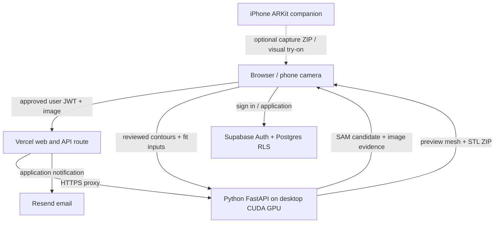

# OptiFrame

**Give existing lenses a new frame.** OptiFrame photographs the left and right lenses on a printed calibration sheet, proposes each edge, lets a person review the measurements, and builds an asymmetric, printable frame around those two outlines. This repository includes the browser workflow, Python GPU service, experimental iPhone ARKit companion, and Vercel/Supabase account flow.

> **Prototype status:** the STL is a fit-test kit, not a medically verified spectacle frame. A photo cannot establish prescription, optical centre, lens thickness, bevel, or the exact curved surface. Check the printed scale, physical lenses, retention, and wearer alignment with an eye-care provider. The proposed 0.5 mm target is a validation gate, not a demonstrated accuracy claim.

## How it works

```mermaid
flowchart LR
  A[Print and verify capture sheet] --> B[Scan left lens]
  B --> C[Remove it; show empty sheet]
  C --> D[Scan right lens]
  D --> E[Review both outlines]
  E --> F[Enter wearer fit and measured edge thickness]
  F --> G[Choose style and retention]
  G --> H[Inspect 3D preview]
  H --> I[Download STL fit-test kit]
  I --> J[Slice, print, physically verify]
```



The browser says **Left lens**, then **Remove left lens**. If automatic empty-sheet detection stalls, press **Sheet is empty**; this releases only the removal requirement. The right lens still needs its own valid edge, calibration and review. Photo import is available when live capture is unreliable. Print [the 100 × 70 mm sheet](web/calibration-sheet.svg) at 100% and verify its 50 mm ruler line.

## Run locally

| Component | Requirement |
| --- | --- |
| Web UI and tests | Current Chrome, Edge or Safari; Node.js 22+ for build/tests |
| Python service | Python 3.12+ and [requirements.txt](gpu/requirements.txt) |
| SAM 2.1 edge proposal | NVIDIA CUDA GPU, compatible CUDA PyTorch build, internet for first model download |
| iPhone companion | Mac, Xcode, XcodeGen and a physical device for ARKit; [instructions](ios/README.md) |
| Public sign-in | Supabase, Vercel and configured email; optional for local development |

From the repository root on Windows PowerShell:

```powershell
py -3.12 -m venv .venv
.\.venv\Scripts\Activate.ps1
python -m pip install --upgrade pip
python -m pip install -r gpu/requirements.txt
python -m uvicorn segment:app --app-dir gpu --host 127.0.0.1 --port 8765
```

On macOS/Linux, use `python3 -m venv .venv`, `source .venv/bin/activate`, then the same `pip` and `uvicorn` commands. Open **http://127.0.0.1:8765/**. FastAPI serves `web/` in development, so this route needs no npm install or frontend build. Local developer mode permits requests without sign-in: **keep it bound to loopback and never expose port 8765 publicly**.

### Reproduce the GPU path

The service loads `facebook/sam2.1-hiera-small` through Transformers on the first GPU proposal in developer mode. Weights download into the user's Hugging Face cache; they are **not** in Git. Production mode requires pre-cached weights and warms the model before reporting ready. SAM adds an outline *proposal*; scale calibration, edge finishing, user review and physical checks remain separate.

Install the CUDA-enabled PyTorch build appropriate to your OS, Python, driver and GPU via the [official PyTorch selector](https://pytorch.org/get-started/locally/). The tested RTX 5070 Windows direct-package versions and CUDA wheel are recorded in [requirements-desktop.txt](gpu/requirements-desktop.txt); it is **not a complete transitive lockfile**. CPU-only machines can run deterministic tests and non-SAM paths, but current live SAM inference requires CUDA.

```powershell
Invoke-RestMethod http://127.0.0.1:8765/api/health
```

Use a lens photo on the calibrated sheet in the scanner. Keep all four markers visible. Left and right captures are independent. See the [capture pipeline](docs/lens-capture-pipeline.md), [GPU API and STL guide](gpu/README.md), and [validation protocol](docs/validation.md).

## Architecture



Vercel hosts static files and a small notification function. Supabase owns accounts, approval and row-level access. The GPU service is currently a **user-operated Windows desktop**, not a managed cloud GPU. Checked-in [vercel.json](vercel.json) points to a **temporary Cloudflare tunnel**; update it to a stable protected backend origin for a new deployment. No AWS service is required. See [architecture and trust boundaries](docs/architecture.md), [backend operations](docs/production-backend.md), and [account setup](docs/supabase-accounts.md).

## Verify

```powershell
python -m unittest discover -s gpu -p 'test_*.py' -v
python -m unittest discover -s deploy -p 'test_*.py' -v
node --test web/*.test.mjs web/*.test.cjs api/*.test.mjs
node deploy/build-web.mjs
```

CI runs Python and web tests on Linux, supervisor tests on Windows, and an unsigned iOS Simulator build/test on macOS. Synthetic tests cover control flow and geometry invariants; they do **not** prove lens-edge accuracy, phone reliability, hinge strength or wearer safety. [Validation](docs/validation.md) records physical checks and open limits.

## Public deployment

The browser build accepts only `SUPABASE_URL`, `SUPABASE_PUBLISHABLE_KEY` and `SUPABASE_GOOGLE_ENABLED` as public account configuration. Put them in Vercel environment settings. The server-side notification function needs `SUPABASE_SERVICE_ROLE_KEY`, `RESEND_API_KEY`, `RESEND_FROM` and Vercel's `CRON_SECRET`. The GPU worker uses the Supabase URL and publishable key to verify user approval; the optional internal test key is `OPTIFRAME_ACCESS_TOKEN`. **Never put service-role, Resend, GPU test or Higgsfield credentials in `web/` or a commit.** See [account access](docs/account-access-backend.md) and [security](SECURITY.md).

```powershell
node deploy/build-web.mjs
```

Cloning does not provision Vercel or Supabase. Apply [supabase/migrations](supabase/migrations) in filename order, configure Auth and email, and set environment values per [docs/supabase-accounts.md](docs/supabase-accounts.md). For the local Windows GPU supervisor, use [docs/production-backend.md](docs/production-backend.md). Do not publish a developer-mode server to bypass auth.

## Repository map

| Path | Purpose |
| --- | --- |
| [web/](web/) | Landing page, scanner, fit wizard, viewer and browser tests |
| [gpu/](gpu/) | FastAPI, SAM proposal, edge finishing, parametric CAD and STL tests |
| [ios/](ios/) | SwiftUI/ARKit capture and visual try-on prototype |
| [supabase/](supabase/) | Accounts, waitlist, approval and email SQL |
| [api/](api/) | Vercel application-email handler |
| [deploy/](deploy/) | Static build and Windows GPU supervisor |
| [docs/](docs/) | Capture, fitting, validation, operations and decisions |
| [demos/higgsfield/](demos/higgsfield/) | Optional marketing scripts; the scanner does not require Higgsfield |

Code and included assets are released under [MIT](LICENSE); third-party model weights, SDKs, fonts and generated media retain their own terms. Asset origins are in [web/assets/provenance.json](web/assets/provenance.json). See [CONTRIBUTING.md](CONTRIBUTING.md) for changes and test expectations.
