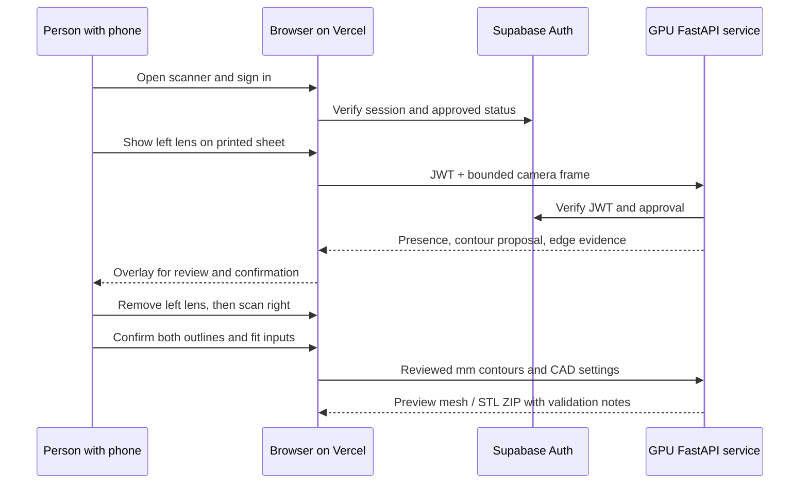

# Architecture and data flow

OptiFrame keeps lens measurement inspectable. The capture image, the proposed contour, the four sheet markers, the reviewed contour and the physical fit checks are distinct records. Neither a nice preview nor a SAM mask certifies a real lens fit.

## Boundaries

| Boundary | Responsibility | What it does not establish |
| --- | --- | --- |
| Browser | Camera, marker detection, homography, outline review, consent and fit wizard | Prescription, clinical optical centre, physical edge bevel |
| GPU service | SAM 2.1 proposal, presence/edge checks, CAD mesh and STL export | A medically valid lens or finished wearable frame |
| Supabase | Session, email confirmation, waitlist, approval and row-level access | GPU availability or geometry accuracy |
| Vercel | Static web build, app-config publication, notification endpoint, API rewrite | GPU compute or private image storage |
| iPhone app | Optional ARKit capture and visual try-on | A web-accessible TrueDepth API or optician measurement |

The production GPU worker checks authorization before parsing an upload or taking its single expensive-work slot. Captures are processed as request data; the API does not add a patient-image database. The browser holds the confirmed pair in session storage for the wizard. See [account access](account-access-backend.md), [backend runtime](runtime-hardening.md) and [security](../SECURITY.md).

## Lens geometry

1. Four printed markers define a sheet-plane homography. A real ruler verifies print scale.
2. Presence checks and SAM 2.1 propose a closed edge in the original image. Shadow-aware finishing rejects unsupported boundaries.
3. The browser projects the reviewed contour to millimetres and keeps left/right outlines separate.
4. Manually supplied optical-centre/top marks and wearer fit inputs position both lenses in a shared assembly.
5. CAD generates the front, retainers/clips and temples; the selected retention method changes actual geometry. The export validates meshes and bed placement, then provides a fit-test STL kit.

Transparent surfaces and camera perspective limit inference. AR depth is experimental scene evidence, not the size source for a clear lens. The 0.5 mm target needs repeat captures, caliper comparison, a 1:1 printed outline and a physical seat test before it can be claimed. See [lens capture](lens-capture-pipeline.md) and [validation](validation.md).

## Deployment decision

The website is on Vercel; accounts are in Supabase; email is via Resend; GPU inference currently runs on a supervised Windows desktop through a temporary Cloudflare tunnel. The desktop must remain awake and the tunnel can change. The checked-in Vercel rewrite is therefore a reproducible example of the current topology, not a durable GPU hosting solution. A new operator must provision those services, configure credentials outside Git and replace the temporary tunnel endpoint. See [backend operations](production-backend.md).
